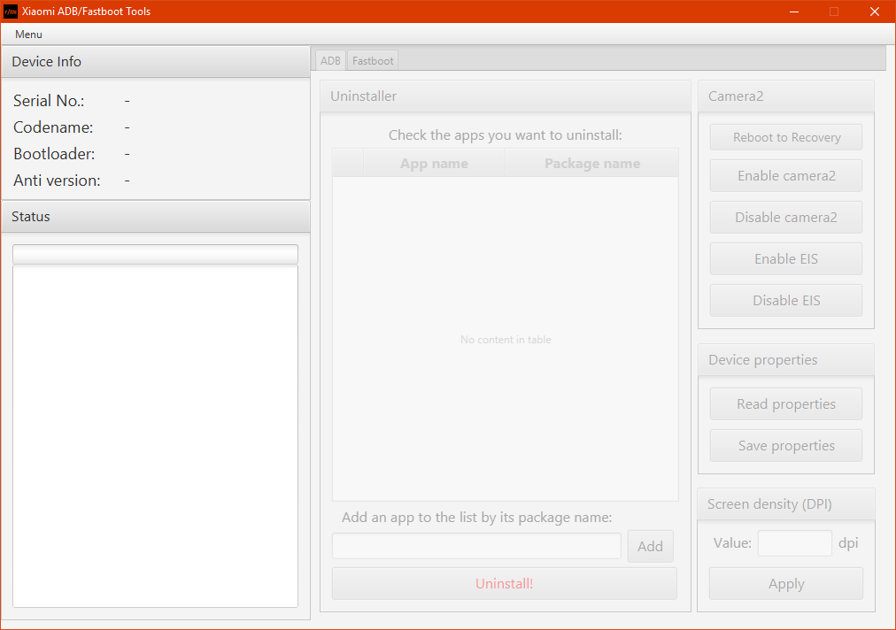

# Xiaomi ADB/Fastboot Tools

## Features

* **Uninstaller** - Remove pre-installed apps and services on demand
* **Camera2 & EIS Enabler** - Enable Camera2 and EIS (TWRP required)
* **Read device properties** - Retrieve tons of statistics and information about your phone
* **Flasher** - Flash any partition with an image, boot to any image or flash a Fastboot ROM (unlocked bootloader required)
* **Wiper** - Wipe the cache or perform a factory reset
* **OEM Unlocker & Locker** - Lock or unlock the bootloader (Unlocking is supported by the Android One phones only)
* **Rebooter** - Advanced rebooting options using ADB/Fastboot

## Download the executable JAR from [here](https://github.com/Saki-EU/XiaomiADBFastbootTools/releases/latest).

**Warning: Use the tools at your own risk. Removing apps which aren't listed in the Debloater may break your phone.**

## Instructions

### Loading a device in ADB mode

1. Enable developer options in Android.

    * MIUI: Go to Settings > About device and tap ‘MIUI version’ seven times to enable developer options.
    * Android One: Go to Settings > System > About device and tap ‘Build number’ seven times to enable developer options.

2. Enable USB debugging in Android.

    * MIUI: Go to Settings > Additional settings > Developer options and enable USB debugging.
    * Android One: Go to Settings > System > Developer options and enable USB debugging.

3. Connect your device to your computer and launch the application. The device will ask for authorisation right away, which you have to allow.

4. Load your device by clicking Menu > Check for device in the application. Your device info should appear.

### Loading a device in Fastboot mode

1. Put your device into Fastboot mode by holding power and volume down simultaneously until the Fastboot splash screen comes up.

    * If your device is loaded in ADB mode, you can enter Fastboot mode by clicking Menu > Reboot device to Fastboot.

2. Connect your device to your computer and launch the application.

3. Load your device by clicking Menu > Check for device in the application. Your device info should appear.

## Frequently Asked Questions

* **Q:** The tool doesn't launch on my computer, is there anything I should have installed?

    * **A:** Yes, the tool was developed in Java and needs the Java Runtime Environment to run. You can download Java from [here](https://java.com/en/download/). On Linux, OpenJFX is needed alongside OpenJRE to run the application.

* **Q:** The tool on Windows doesn't detect my phone even though it's connected and USB debugging is enabled. What's the problem?

    * **A:** Windows most likely does not recognise your phone in ADB. Install the universal ADB drivers from [here](http://dl.adbdriver.com/upload/adbdriver.zip).

* **Q:** Do I need an unlocked bootloader or root access to use the tool?

    * **A:** The Image Flasher, the Wiper and the Camera2 enabler require an unlocked bootloader but everything else works without rooting or unlocking.

* **Q:** Do uninstalled system apps affect OTA updates?

    * **A:** No, you are free to install updates without the fear of bricking your device or losing data.

* **Q:** The tool is called Xiaomi ADB/Fastboot Tools. Does that mean it only works with Xiaomi devices?

    * **A:** Well, ADB and Fastboot are universal interfaces for Android devices but some of the algorithms and methods used in the app are Xiaomi specific, so yes.

* **Q:** Does this replace MiFlash or MiUnlock?

    * **A:** No. Fastboot ROM flashing is available, but implementing other features in such a simple tool would only make it unnecessarily complex.
