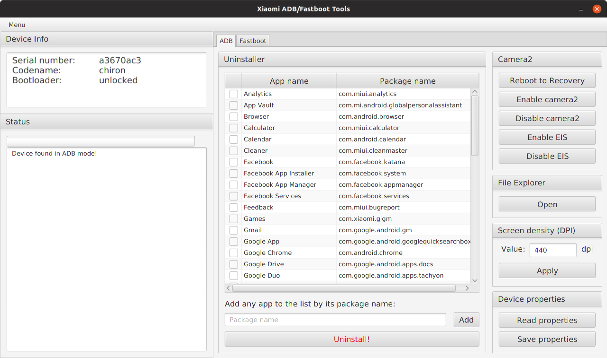

# Xiaomi ADB/Fastboot Tools

## Modules

* **Uninstaller** - Remove pre-installed apps and services on demand
* **Camera2** - Enable Camera2 and EIS (TWRP required)
* **Device properties** - Retrieve tons of statistics and information about your device
* **Screen density** - Tweak screen density by overriding the DPI value
* **Flasher** - Flash any partition with an image, boot to any image or flash a Fastboot ROM (unlocked bootloader required)
* **Wiper** - Wipe the cache or perform a factory reset
* **OEM Unlocker & Locker** - Lock or unlock the bootloader (Unlocking is only supported by Android One devices)
* **ROM Downloader** - Get links to the latest MIUI Fastboot ROMs or download them right away
* **Rebooter** - Advanced rebooting options using ADB/Fastboot

## Download the executable JAR from [here](https://github.com/Saki-EU/XiaomiADBFastbootTools/releases/latest).

**Warning: Use the program at your own risk. Removing apps which aren't listed in the Uninstaller by default may brick your device.**

## Instructions

### Connecting a device in ADB mode

1. Enable developer options in Android.

    * MIUI: Go to Settings > About device and tap ‘MIUI version’ seven times to enable developer options.
    * Android One: Go to Settings > System > About device and tap ‘Build number’ seven times to enable developer options.

2. Enable USB debugging in Android.

    * MIUI: Go to Settings > Additional settings > Developer options and enable USB debugging as well as USB debugging (Security settings).
    * Android One: Go to Settings > System > Developer options and enable USB debugging.

3. Connect your device to the computer and launch the application. The device is going to ask for authorisation, which you'll have to allow.

4. Wait for the application to detect your device. The device info should appear in the top left section.

### Connecting a device in Fastboot mode

1. Put your device into Fastboot mode by holding power and volume down simultaneously until the Fastboot splash screen comes up.

    * If your device is loaded in ADB mode, you can enter Fastboot mode by clicking Menu > Reboot device to Fastboot.

2. Connect your device to the computer and launch the application.

3. Wait for the application to detect your device. The device info should appear in the top left section.

## Frequently Asked Questions

**The application doesn't launch, is there anything I should have installed?**

Yes, it was developed in Kotlin and needs the Java Runtime Environment to run. You can install Java from [here](https://java.com/en/download/). On Linux, you need to have OpenJDK 8 and OpenJFX installed. Please note, that Java 11 does not come with JavaFX so you may have to uninstall it in order to run the application.

**The app on Windows doesn't detect my device even though it's connected and USB debugging is enabled. What could be the issue?**

Windows most likely doesn't recognise your device in ADB mode. Install the universal ADB drivers from [here](http://dl.adbdriver.com/upload/adbdriver.zip), reboot your PC and try again.

**What apps are safe to uninstall?**

All applications in the list are safe to uninstall. You'll lose some features but the phone will keep working just fine. Some apps, like Gallery, aren't listed because uninstalling them would soft brick your phone.

**Do uninstalled system apps affect OTA updates?**

No, you are free to install updates without the fear of bricking your device or losing data.

**Do I need an unlocked bootloader or root access to use the app?**

The Flasher, Wiper and Camera2 modules require an unlocked bootloader but everything else works without rooting or unlocking.

**Why does the Uninstaller hang on some apps?**

There are many factory apps Global MIUI doesn't let you uninstall but China MIUI does. If you try to uninstall such an app, the tool will hang. Disconnect your device, uninstall the app then reconnect the device to proceed.

**How do I regain uninstalled system apps?**

When you uninstall apps, you erase them from `/data` so you need to factory reset to make your device reinstall them (from `/system`).

**The app is called Xiaomi ADB/Fastboot Tools. Does that mean it only works with Xiaomi devices?**

ADB and Fastboot are universal interfaces for Android devices but some of the algorithms and methods used in the app are specific to Xiaomi devices, so yes.

**Does this replace MiFlash or MiUnlock?**

No. Fastboot ROM flashing is available so MiFlash can mostly be substituted but implementing EDL flashing or unlocking in such a simple tool would only make it unnecessarily complex.
